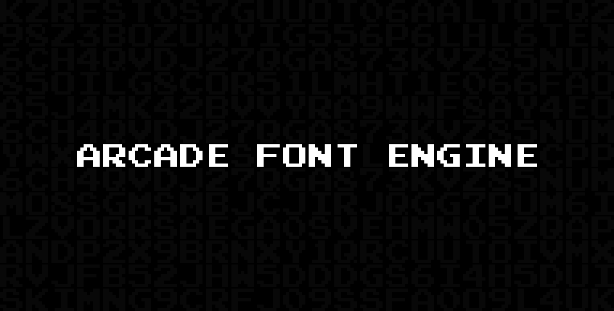

# 👾 [Arcade Font Engine](https://github.com/flameshikari/arcade-font-engine) [](https://github.com/flameshikari/arcade-font-engine/actions)

## ℹ️ Description

The backend was coded in PHP by <a href="https://nfgworld.com/">NFG</a> (you can the original source code from <a href="https://nfggames.com/system/arcade/builder.php">here</a>). I remade the frontend based on <a href="https://nfggames.com/games/fontmaker/">the original website</a> with my own vision, tweaked the PHP-script a little and containerized the app.


## 🐳 Installation

Available in <a href="https://github.com/flameshikari/arcade-font-engine/pkgs/container/arcade-font-engine">GHCR</a> and <a href="https://hub.docker.com/r/flameshikari/arcade-font-engine">Docker Hub</a> for multiple platforms.

```yaml
services:
  arcade-font-engine:
    image: flameshikari/arcade-font-engine
    container_name: arcade-font-engine
    ports:
      - 8080:8080
    volume:
      - ./cache:/var/www/html/cache # persist cache
```
